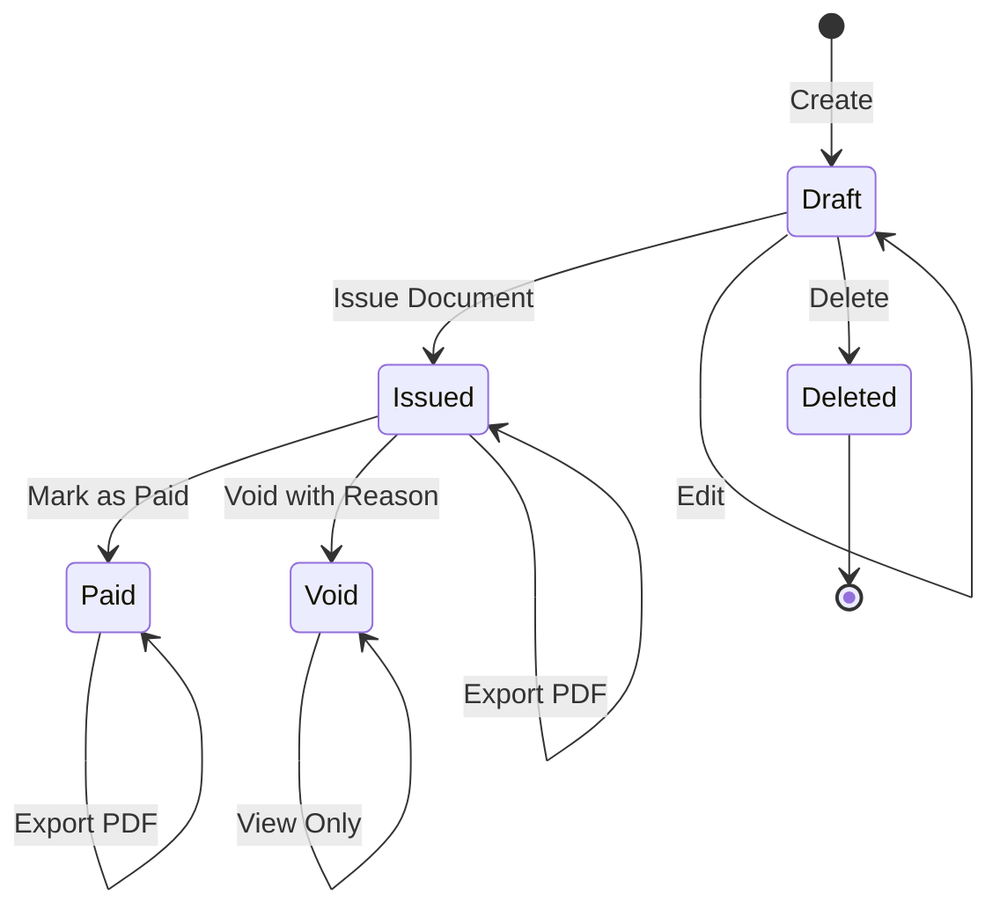

# Product Requirements Document (PRD)
# AccountThai — ระบบจัดการเอกสารบัญชีออนไลน์

**Version:** 1.0
**Date:** April 15, 2026
**Author:** John (Product Manager)
**Status:** Draft — Awaiting Review

---

## 1. Executive Summary

AccountThai is a purpose-built web application for Thai SME business owners to create, manage, and export accounting documents (Tax Invoices, Expense Records, Withholding Tax certificates, Quotations, Invoices, and Receipts) as standardized PDF files. The system replaces the expensive FlowAccount subscription by focusing exclusively on the document generation and management features actually used by the business.

**Key differentiator:** Focused simplicity — only the features you need, with automatic Google Drive backup.

## 2. Goals & Objectives

### Business Goals
1. **Eliminate FlowAccount subscription cost** — save recurring monthly fees
2. **Full ownership of accounting document system** — no vendor lock-in
3. **Future revenue opportunity** — multi-tenant SaaS for other Thai SMEs (Phase 2)

### Product Goals
1. Create and export 6 types of Thai accounting documents as PDF
2. Maintain complete document history with search and filtering
3. Provide monthly financial summaries
4. Auto-backup all documents to Google Drive
5. Support data import from Excel/CSV/PDF

### Success Metrics

| Metric | Target | Measurement |
|---|---|---|
| Document creation time | < 2 min per document | Timer from start to PDF export |
| FlowAccount replacement | 100% feature coverage for used features | Feature comparison checklist |
| System uptime | 99.5% | Monitoring |
| Search response time | < 500ms | Performance monitoring |

## 3. User Personas

### Persona 1: Mujahid (Primary — Phase 1)
- **Role:** Business owner, บริษัท เอ็ม เอ็น กรุ๊ป 2021 จำกัด
- **Context:** Sells products via Lazada & Shopee marketplace
- **Needs:** Issue tax invoices to marketplace platforms and individual buyers, track expenses, generate withholding tax certificates
- **Pain:** Paying for FlowAccount Pro when only using ~20% of features
- **Tech comfort:** Intermediate — can use web apps confidently

### Persona 2: Future SME Owner (Phase 2)
- **Role:** Small business owner needing basic accounting docs
- **Needs:** Same document types, isolated data, company branding
- **Willingness to pay:** Lower than FlowAccount pricing

## 4. Functional Requirements

### 4.1 Authentication & Authorization

| ID | Requirement | Priority | Phase |
|---|---|---|---|
| AUTH-01 | Email/password login | Must Have | 1 |
| AUTH-02 | Session management with secure tokens | Must Have | 1 |
| AUTH-03 | Multi-tenant organization support | Must Have | 2 |
| AUTH-04 | Role-based access (Owner, Editor, Viewer) | Nice to Have | 2 |

### 4.2 Company Profile Management

| ID | Requirement | Priority | Phase |
|---|---|---|---|
| COMP-01 | Store company information (name, address, tax ID, branch) | Must Have | 1 |
| COMP-02 | Upload company logo for document branding | Must Have | 1 |
| COMP-03 | Configure document running number format per company | Must Have | 1 |
| COMP-04 | Multiple company profiles per tenant | Nice to Have | 2 |

### 4.3 Contact/Partner Management

| ID | Requirement | Priority | Phase |
|---|---|---|---|
| CONT-01 | CRUD contacts (customers, vendors, partners) | Must Have | 1 |
| CONT-02 | Store contact details: name, address, tax ID, branch | Must Have | 1 |
| CONT-03 | Quick-select contacts when creating documents | Must Have | 1 |
| CONT-04 | Import contacts from CSV | Nice to Have | 1 |

### 4.4 Document Management

#### 4.4.1 Document Types

Six document types are supported, each with specific fields and PDF layouts:

**A. ใบกำกับภาษี (Tax Invoice — INV)**

| Field | Type | Required |
|---|---|---|
| Document number | Auto-generated (INV{YYYY}{MM}{NNNN}) | Yes |
| Date | Date | Yes |
| Customer/Partner info | Reference to Contact | Yes |
| Line items (description, qty, unit price, amount) | Array | Yes |
| VAT calculation (7%) | Calculated | Yes |
| Total amount before VAT | Calculated | Yes |
| VAT amount | Calculated | Yes |
| Grand total | Calculated | Yes |
| Notes/Remarks | Text | No |

**B. ใบบันทึกค่าใช้จ่าย (Expense Record — EXP)**

| Field | Type | Required |
|---|---|---|
| Document number | Auto-generated (EXP{YYYY}{MM}{NNNN}) | Yes |
| Date | Date | Yes |
| Vendor/Shop name | Reference to Contact | Yes |
| Expense category | Dropdown | Yes |
| Description | Text | Yes |
| Amount | Number | Yes |
| VAT (if applicable) | Number | No |
| Withholding tax (if applicable) | Number | No |
| Payment method | Dropdown | No |
| Notes | Text | No |

**C. ใบหัก ณ ที่จ่าย (Withholding Tax — WT)**

| Field | Type | Required |
|---|---|---|
| Document number | Auto-generated (WT{YYYY}{MM}{NNNN}) | Yes |
| Date | Date | Yes |
| Payer info (company) | Auto-filled from company profile | Yes |
| Payee info | Reference to Contact | Yes |
| Income type (ภ.ง.ด. categories) | Dropdown | Yes |
| Tax rate (%) | Number | Yes |
| Income amount | Number | Yes |
| Tax withheld amount | Calculated | Yes |
| Filing form type (ภ.ง.ด.3 / ภ.ง.ด.53) | Dropdown | Yes |

**D. ใบเสนอราคา (Quotation — QT)**

| Field | Type | Required |
|---|---|---|
| Document number | Auto-generated (QT{YYYY}{MM}{NNNN}) | Yes |
| Date | Date | Yes |
| Valid until date | Date | Yes |
| Customer info | Reference to Contact | Yes |
| Line items | Array | Yes |
| Discount (if any) | Number | No |
| VAT calculation | Calculated | Yes |
| Grand total | Calculated | Yes |
| Terms & conditions | Text | No |
| Status (draft/sent/accepted/rejected) | Enum | Yes |

**E. ใบแจ้งหนี้ (Invoice / Billing — BL)**

| Field | Type | Required |
|---|---|---|
| Document number | Auto-generated (BL{YYYY}{MM}{NNNN}) | Yes |
| Date | Date | Yes |
| Due date | Date | Yes |
| Customer info | Reference to Contact | Yes |
| Reference (Quotation number, if any) | Text | No |
| Line items | Array | Yes |
| VAT calculation | Calculated | Yes |
| Grand total | Calculated | Yes |
| Payment status (pending/paid/overdue) | Enum | Yes |

**F. ใบเสร็จรับเงิน (Receipt — RE)**

| Field | Type | Required |
|---|---|---|
| Document number | Auto-generated (RE{YYYY}{MM}{NNNN}) | Yes |
| Date | Date | Yes |
| Customer info | Reference to Contact | Yes |
| Reference (Invoice number, if any) | Text | No |
| Line items | Array | Yes |
| Payment method | Dropdown | Yes |
| VAT calculation | Calculated | Yes |
| Grand total | Calculated | Yes |

#### 4.4.2 Document Operations

| ID | Requirement | Priority | Phase |
|---|---|---|---|
| DOC-01 | Create new document (any of 6 types) | Must Have | 1 |
| DOC-02 | Edit draft documents | Must Have | 1 |
| DOC-03 | Delete documents (soft delete) | Must Have | 1 |
| DOC-04 | Duplicate existing document | Should Have | 1 |
| DOC-05 | Convert between types (e.g., Quotation → Invoice → Receipt) | Should Have | 1 |
| DOC-06 | Void/Cancel documents with reason | Must Have | 1 |
| DOC-07 | Document status workflow (Draft → Issued → Paid/Void) | Must Have | 1 |

### 4.5 PDF Export

| ID | Requirement | Priority | Phase |
|---|---|---|---|
| PDF-01 | Generate PDF for any document type | Must Have | 1 |
| PDF-02 | PDF includes company logo, letterhead, contact info | Must Have | 1 |
| PDF-03 | Thai text support (Thai fonts) | Must Have | 1 |
| PDF-04 | Amount in Thai Baht text (e.g., "หนึ่งพันห้าร้อยบาทถ้วน") | Should Have | 1 |
| PDF-05 | Filename format: `{Company}_{DocNumber}_{Partner}.pdf` | Must Have | 1 |
| PDF-06 | Batch PDF export (multiple documents) | Nice to Have | 1 |
| PDF-07 | PDF preview before download | Must Have | 1 |

### 4.6 Data Import

| ID | Requirement | Priority | Phase |
|---|---|---|---|
| IMP-01 | Import data from Excel (.xlsx) files | Must Have | 1 |
| IMP-02 | Import data from CSV files | Must Have | 1 |
| IMP-03 | Import/scan data from PDF invoices | Should Have | 2 |
| IMP-04 | Column mapping UI for flexible imports | Must Have | 1 |
| IMP-05 | Import validation with error reporting | Must Have | 1 |
| IMP-06 | Preview before confirming import | Must Have | 1 |

### 4.7 Search & History

| ID | Requirement | Priority | Phase |
|---|---|---|---|
| SRCH-01 | Full-text search across all documents | Must Have | 1 |
| SRCH-02 | Filter by document type | Must Have | 1 |
| SRCH-03 | Filter by date range | Must Have | 1 |
| SRCH-04 | Filter by partner/contact | Must Have | 1 |
| SRCH-05 | Filter by status | Must Have | 1 |
| SRCH-06 | Sort by date, amount, document number | Must Have | 1 |
| SRCH-07 | Pagination for large result sets | Must Have | 1 |

### 4.8 Dashboard & Reports

| ID | Requirement | Priority | Phase |
|---|---|---|---|
| DASH-01 | Monthly summary by document type | Must Have | 1 |
| DASH-02 | Total income vs expenses overview | Must Have | 1 |
| DASH-03 | Recent documents list | Must Have | 1 |
| DASH-04 | Outstanding invoices (unpaid) | Should Have | 1 |
| DASH-05 | VAT summary for tax filing | Should Have | 1 |
| DASH-06 | Withholding tax summary (ภ.ง.ด.3/53 report) | Should Have | 2 |
| DASH-07 | Export summary reports to Excel/CSV | Should Have | 1 |

### 4.9 Google Drive Integration

| ID | Requirement | Priority | Phase |
|---|---|---|---|
| GDRIVE-01 | OAuth2 connection to Google Drive | Must Have | 1 |
| GDRIVE-02 | Auto-upload PDF on document creation | Must Have | 1 |
| GDRIVE-03 | Folder structure: `/{Year}/{Month}/{DocType}/` | Must Have | 1 |
| GDRIVE-04 | Manual re-upload/sync option | Should Have | 1 |
| GDRIVE-05 | Drive folder link stored per document | Should Have | 1 |

## 5. Non-Functional Requirements

### 5.1 Performance
- Page load time < 2 seconds
- PDF generation < 3 seconds per document
- Search results returned < 500ms

### 5.2 Security
- HTTPS everywhere
- Encrypted passwords (bcrypt)
- CSRF protection
- Input validation and sanitization
- Tenant data isolation (Phase 2)

### 5.3 Localization
- UI language: Thai (primary)
- Document output: Thai
- Currency: Thai Baht (฿)
- Date format: DD/MM/YYYY (Buddhist Era support optional)
- Number format: Thai comma-separated (1,000.00)

### 5.4 Browser Support
- Chrome (latest 2 versions)
- Safari (latest 2 versions)
- Firefox (latest 2 versions)
- Mobile responsive design

### 5.5 Data Backup
- Database backup schedule (daily)
- Point-in-time recovery capability
- Google Drive as secondary document backup

## 6. Information Architecture

```
AccountThai
├── 🏠 Dashboard
│   ├── Monthly Summary
│   ├── Recent Documents
│   └── Quick Actions (Create New Document)
├── 📄 Documents
│   ├── All Documents (with filters)
│   ├── ใบกำกับภาษี (INV)
│   ├── ใบบันทึกค่าใช้จ่าย (EXP)
│   ├── ใบหัก ณ ที่จ่าย (WT)
│   ├── ใบเสนอราคา (QT)
│   ├── ใบแจ้งหนี้ (BL)
│   └── ใบเสร็จรับเงิน (RE)
├── 👥 Contacts
│   ├── All Contacts
│   └── Add/Edit Contact
├── 📊 Reports
│   ├── Monthly Summary
│   ├── VAT Summary
│   └── Withholding Tax Summary
├── 📤 Import
│   └── Import from Excel/CSV
├── ⚙️ Settings
│   ├── Company Profile
│   ├── Google Drive Connection
│   ├── Document Number Settings
│   └── Account Settings
└── 🔐 Auth
    ├── Login
    └── Register (Phase 2)
```

## 7. Document Lifecycle



## 8. Technical Constraints & Considerations

- **PDF Generation:** Must support Thai fonts (Sarabun, TH SarabunPSK) with proper rendering
- **Running Numbers:** Must be atomic and sequential per document type per month
- **Google Drive API:** Rate limits apply — implement retry with exponential backoff
- **Data Import:** Excel/CSV parsing must handle Thai character encoding (UTF-8)
- **Multi-tenant (Phase 2):** Database design should accommodate tenant isolation from the start even if not exposed in Phase 1

## 9. Out of Scope (Phase 1)

- ❌ Inventory/Stock management
- ❌ Point of Sale (POS)
- ❌ Payroll
- ❌ Bank reconciliation
- ❌ E-commerce platform integration (Lazada/Shopee API)
- ❌ e-Tax Invoice submission to Revenue Department
- ❌ Mobile native app (responsive web only)
- ❌ Multi-language support (Thai only)

## 10. Risks & Mitigations

| Risk | Impact | Likelihood | Mitigation |
|---|---|---|---|
| PDF Thai font rendering issues | High | Medium | Early prototype and testing of PDF library with Thai fonts |
| Google Drive API rate limiting | Medium | Low | Implement queue and retry mechanism |
| Running number conflicts (concurrent users) | High | Low (Phase 1) | Database-level atomic sequences |
| Data migration from FlowAccount | Medium | Medium | Export FlowAccount data to CSV first, then import |
| Scope creep toward full accounting system | High | High | Strict adherence to PRD scope; defer all non-MVP features |

## 11. Release Plan

### Phase 1 — Core MVP (Target: 6-8 weeks)
**Goal:** Replace FlowAccount for MN Group 2021

| Sprint | Focus |
|---|---|
| Sprint 1 | Project setup, Auth, Company Profile, Database schema |
| Sprint 2 | Contact management, Document CRUD (INV, EXP) |
| Sprint 3 | Document CRUD (WT, QT, BL, RE), Running numbers |
| Sprint 4 | PDF Export with Thai fonts, Download |
| Sprint 5 | Dashboard, Monthly summary, Search & filters |
| Sprint 6 | Google Drive integration, Import (Excel/CSV) |
| Sprint 7 | Polish, testing, deployment |

### Phase 2 — Multi-Tenant SaaS (Target: 4-6 weeks after Phase 1)
### Phase 3 — Advanced Features (Ongoing)

## 12. Appendix

### A. Document Number Format Specification

```
{Prefix}{YYYY}{MM}{NNNN}

Where:
- Prefix: INV | EXP | WT | QT | BL | RE
- YYYY: 4-digit year (e.g., 2026)
- MM: 2-digit month (e.g., 03)
- NNNN: 4-digit running number, reset monthly (e.g., 0001)

Example: INV2026030001 = Tax Invoice, March 2026, document #1
```

### B. PDF Filename Convention

```
{CompanyName}_{DocNumber}_{PartnerName}.pdf

Example:
บริษัท เอ็ม เอ็น กรุ๊ป 2021 จำกัด_INV2026030001_Lazada Limited.pdf
```

### C. Google Drive Folder Structure

```
AccountThai/
├── 2026/
│   ├── 01-มกราคม/
│   │   ├── ใบกำกับภาษี/
│   │   ├── ใบบันทึกค่าใช้จ่าย/
│   │   ├── ใบหัก ณ ที่จ่าย/
│   │   ├── ใบเสนอราคา/
│   │   ├── ใบแจ้งหนี้/
│   │   └── ใบเสร็จรับเงิน/
│   ├── 02-กุมภาพันธ์/
│   └── ...
```

---

*PRD v1.0 — Created by John (Product Manager) — April 15, 2026*
*Pending: Architecture Review, UX Design*
